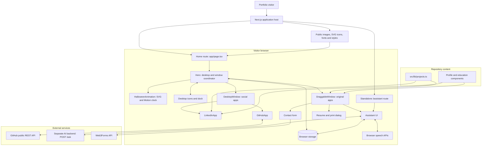
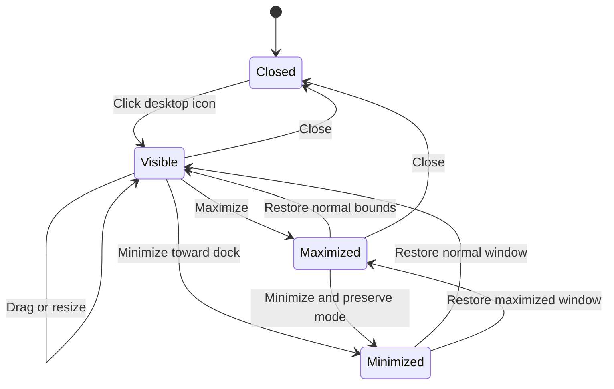
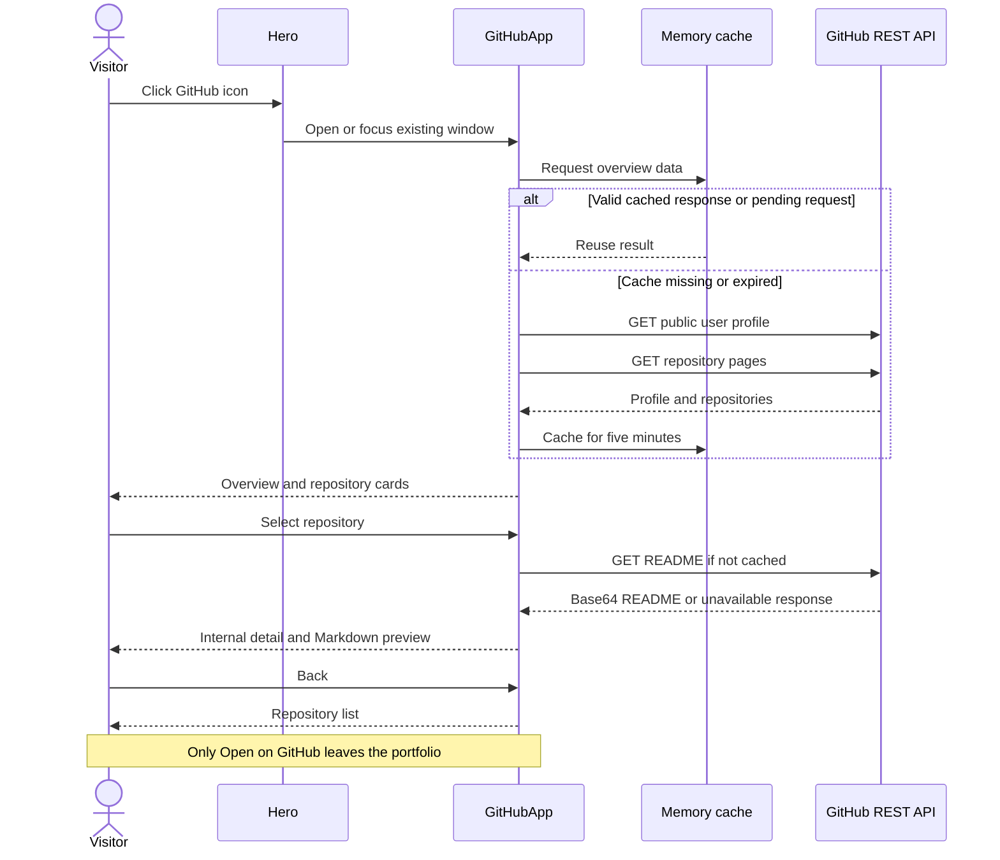
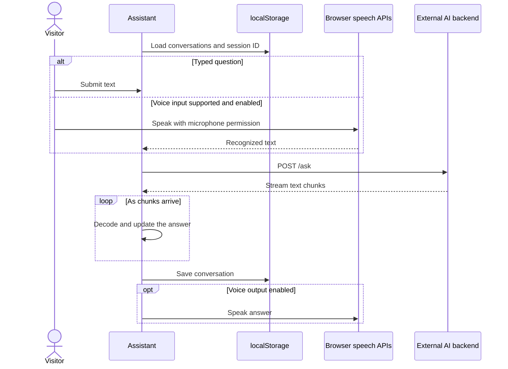
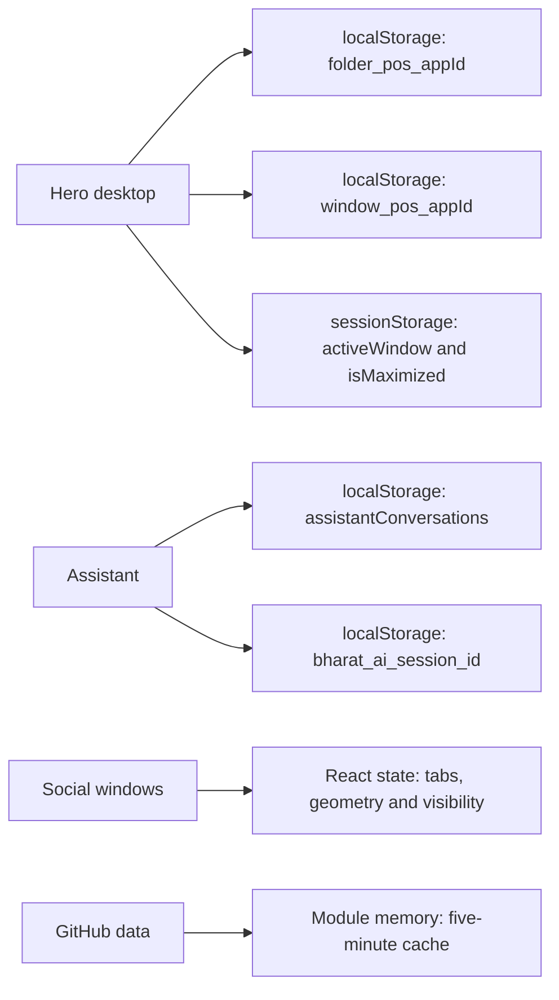

# Bharat Sirmal — Interactive Desktop Portfolio

A personal portfolio built as an interactive desktop with Next.js, React, TypeScript, Tailwind CSS, and Framer Motion. Visitors explore projects, education, skills, and professional profiles through floating application windows while animated SVG eyes and distressed lettering run in the background.

**Website:** [bharatsirmal.vercel.app](https://bharatsirmal.vercel.app/)

This README documents the current source tree. The assistant backend is a separate service; its implementation is not included in this repository.

## Contents

- [Features](#features)
- [Technology stack](#technology-stack)
- [System architecture](#system-architecture)
- [Window lifecycle](#window-lifecycle)
- [GitHub data flow](#github-data-flow)
- [Assistant data flow](#assistant-data-flow)
- [Project structure](#project-structure)
- [Local setup](#local-setup)
- [Configuration](#configuration)
- [State and persistence](#state-and-persistence)
- [Animation system](#animation-system)
- [Customization](#customization)
- [Validation and deployment](#validation-and-deployment)
- [Current limitations](#current-limitations)

## Features

| Area | Behavior |
| --- | --- |
| Desktop | Draggable app icons, saved positions, bottom dock, and floating windows |
| Portfolio apps | About, Projects, Education, Skills, Contact, and printable résumé |
| LinkedIn | Locally authored profile with Overview, About, Education, Projects, Skills, and Certifications tabs |
| GitHub | Live public profile, repositories, search, repository details, README previews, activity, and statistics |
| Social windows | Drag, resize, minimize, maximize, restore, close, focus, and glowing running indicators |
| Jojo assistant | Streaming chat, browser-supported voice input/output, and saved conversations |
| Wallpaper | Inline SVG eyes, pupils, eyelid morphing, distressed text masks, and slice glitches |
| Contact | Web3Forms submission with loading, success, and error states |
| Accessibility | Labeled social controls, keyboard-launchable icons, keyboard resizing, and reduced-motion support in the wallpaper and social windows |

LinkedIn and GitHub app icons open internal windows. External navigation from these apps requires the **View Official LinkedIn** or **Open on GitHub** links.

## Technology stack

Versions are taken from `package.json`.

| Technology | Version | Role |
| --- | --- | --- |
| Next.js | 16.2.1 | App Router, rendering, routing, and builds |
| React / React DOM | 19.2.4 | UI components and interactive state |
| TypeScript | ^5 | Component and API response types |
| Tailwind CSS | ^4 | Responsive styling |
| Framer Motion | ^12.38.0 | Window transitions and SVG animation |
| Lucide React | ^0.473.0 | Interface icons |
| React Markdown | ^10.1.0 | Assistant messages and README previews |
| React to Print | ^3.3.0 | Résumé printing and browser Save as PDF |
| ESLint / eslint-config-next | ^9 / 16.2.1 | Static code checks |

Other declared dependencies include `@fontsource/amarna`, `clsx`, `tailwind-merge`, `react-color`, and `html2pdf.js`. The current résumé printing implementation uses `react-to-print`.

## System architecture



### Component responsibilities

1. `src/app/layout.tsx` provides the document shell, fonts, global styles, and metadata.
2. `/` renders `Hero`, which coordinates the wallpaper, app icons, dock, focus, and running windows.
3. The original portfolio apps use `DraggableWindow`, defined inside `Hero.tsx`. A single `activeWindow` selects the displayed original app.
4. LinkedIn and GitHub use `DesktopWindow`. Both can remain open at once, independently of the original app window.
5. GitHub, assistant, and contact requests originate in the browser and go directly to their external services. There are no local API route handlers or application database in this checkout.
6. `/assistant` also provides a standalone assistant view.

### State ownership

| Owner | State | Responsibility |
| --- | --- | --- |
| `Hero` | `activeWindow`, `isMaximized` | Select and maximize the original portfolio app |
| `Hero` | `socialWindows` | Running social apps, minimized status, and z-index |
| `Hero` | `focusedApp`, `topZ`, `legacyZ` | Coordinate window stacking |
| `DesktopWindow` | `bounds`, `maximized`, pointer interaction | Geometry, dragging, and resizing |
| `LinkedInApp` | Selected tab | Internal profile navigation |
| `GitHubApp` | Tab, selected repository, search query | Internal repository navigation |
| `HalloweenAnimation` | Motion clock and playback preference | Synchronize SVG and text animation |

## Window lifecycle

The following state machine applies to LinkedIn and GitHub. The original portfolio windows use a separate implementation.



- App IDs key the running-window map, preventing duplicate windows.
- Minimizing keeps the component mounted. Its tab, scroll position, and repository selection remain in memory.
- Restoring also focuses the window. Clicking an already open app raises its z-index.
- Maximizing uses screen insets and leaves the dock area available; normal bounds remain available for restore.
- The title bar handles dragging. The bottom-right handle supports pointer resizing and arrow keys.
- Closing removes the app entry and unmounts its content after the exit animation. Its running dock icon disappears.
- Social window state is not persisted across page reloads.

## GitHub data flow



The configured username is `bharatsirmal008` in `GitHubApp.tsx`.

| API path | Purpose |
| --- | --- |
| `/users/{username}` | Name, avatar, bio, location, followers, following, repository count |
| `/users/{username}/repos?sort=updated&per_page=100&page={page}` | Repository cards and aggregate statistics |
| `/users/{username}/events/public?per_page=30` | Recent public activity |
| `/repos/{username}/{repository}/readme` | Repository README preview |

All four use GET requests to `https://api.github.com`. Requests time out after 15 seconds. Repository pagination continues until a page contains fewer than 100 entries. The module cache reuses successful results and pending requests for five minutes; failures are removed so Retry can fetch again.

Featured repositories are original repositories sorted by stars and recent updates, not GitHub pinned repositories. Language statistics count repositories by their primary language rather than measuring code bytes. README previews skip raw HTML, display links as text, and replace images with descriptive placeholders.

## Assistant data flow



The backend's model, database, retrieval pipeline, and authentication are outside this repository. The frontend only establishes the request and streaming-response contract.

## Project structure

```text
profile/
├── public/                     # Icons, profile photo, previews and other assets
├── data/backgrounds.json
├── src/
│   ├── app/
│   │   ├── layout.tsx          # Document shell, fonts, metadata
│   │   ├── page.tsx            # Desktop home page
│   │   ├── globals.css         # Tailwind and global styles
│   │   ├── icon.svg
│   │   ├── fonts/              # Local assets; current layout imports Google fonts
│   │   └── assistant/page.tsx  # Standalone assistant
│   ├── components/
│   │   ├── Hero.tsx            # Desktop and original window implementation
│   │   ├── DesktopWindow.tsx   # Shared social-window shell
│   │   ├── LinkedInApp.tsx
│   │   ├── GitHubApp.tsx
│   │   ├── HalloweenAnimation.tsx
│   │   ├── About.tsx
│   │   ├── Projects.tsx
│   │   ├── Education.tsx
│   │   ├── SkillsMarquee.tsx
│   │   ├── Resume.tsx
│   │   ├── Contact.tsx
│   │   ├── Assistant.tsx
│   │   ├── VoiceBackground.tsx
│   │   ├── RobotLoader.tsx
│   │   ├── LetterReveal.tsx
│   │   └── StudioText.tsx
│   └── lib/
│       ├── projects.ts         # Typed project and case-study content
│       └── utils.ts
├── HALLOWEEN.md
├── next.config.ts
├── postcss.config.mjs
├── eslint.config.mjs
├── tsconfig.json
└── package.json
```

## Local setup

Requirements: Node.js **20.9 or newer** (the installed Next.js package's minimum), npm, and network access for external services and the current Google Font build imports.

From the project folder:

```bash
npm install
npm run dev
```

Open [http://localhost:3000](http://localhost:3000).

To run a production build locally:

```bash
npm run build
npm start
```

To use another development port:

```bash
npm run dev -- --port 3001
```

| Command | Purpose |
| --- | --- |
| `npm run dev` | Development server |
| `npm run build` | Production build and Next.js TypeScript validation |
| `npm start` | Serve an existing production build |
| `npm run lint` | ESLint checks |
| `npx tsc --noEmit` | TypeScript checks without generating JavaScript |

## Configuration

### Assistant backend

Optionally create `.env.local` at the project root:

```dotenv
NEXT_PUBLIC_API_URL=http://localhost:8000
```

The frontend appends `/ask`; configure a base URL without that suffix. Otherwise it uses the Railway endpoint configured in `Assistant.tsx`. Restart development after changing the variable and rebuild deployed applications when changing public build-time configuration.

`NEXT_PUBLIC_` variables are included in browser code. Use this for a public service URL, never for a private API key. The backend must allow the portfolio origin through its CORS configuration.

Expected request:

```http
POST /ask
Content-Type: application/json
Accept: text/event-stream
```

```json
{
  "question": "Tell me about Bharat's projects",
  "voice": false,
  "session_id": "browser-generated-session-id"
}
```

The parser accepts text lines, SSE `data:` lines, or JSON with string `token`, `text`, or `answer` fields. Stream incremental chunks, for example:

```text
data: {"token":"Hello "}

data: {"token":"there."}

data: [DONE]
```

### GitHub and LinkedIn

GitHub uses public requests without a token. Change `USER` in `GitHubApp.tsx` to change the account. Public API limits and unavailable content produce an error or empty state.

LinkedIn is a locally authored profile, not a LinkedIn API integration or embedded LinkedIn page. Update `LinkedInApp.tsx` when information changes. Its project content comes from `src/lib/projects.ts`.

### Contact form

`Contact.tsx` posts form data directly to `https://api.web3forms.com/submit`, then displays success or failure. A successful submission resets the form. Configure your own Web3Forms access key and recipient information before adapting this project for another person. There is no local email server or contact database.

## State and persistence



| Storage | Lifetime |
| --- | --- |
| Local storage | Icon/window positions and assistant conversations survive ordinary reloads until cleared |
| Session storage | Original active app and maximized preference survive reloads within the browser session |
| React state | Social content survives minimize/restore, but resets on unmount or reload |
| GitHub cache | Retained within the current loaded page; cleared by a full reload |

Storage is specific to the browser origin. There is no account-based synchronization between devices. Questions are transmitted to the configured assistant backend, and contact submissions go to Web3Forms.

## Animation system

`HalloweenAnimation` uses inline SVG and one Framer Motion clock. Eye paths clip the pupils; matching eyelid path commands allow interpolation. Deterministic SVG mask scratches create distressed lettering.

```tsx
import { HalloweenAnimation } from "@/components/HalloweenAnimation";

<HalloweenAnimation
  greeting="I AM"
  title="BHARAT SIRMAL"
  color="#ed151f"
  speed={0.5}
  controls={false}
  className="h-full"
/>
```

| Property | Default | Meaning |
| --- | --- | --- |
| `greeting` | `Happy` | Upper text line |
| `title` | `HALLOWEEN` | Main text line |
| `color` | `#ed151f` | SVG foreground color |
| `speed` | `1` | Playback multiplier |
| `controls` | `true` | Play/Pause, Replay, and timeline |
| `className` | Empty | Wrapper layout classes |

The base loop is six seconds; the home page uses `speed={0.5}`, producing a twelve-second loop. In source-timeline time, the greeting reveals from 0.3–1.1 seconds, the main letters from 0.8–2.8 seconds, and intermittent slice glitches follow. Enlarged eyes remain visible throughout the loop.

Reduced-motion visitors see a still frame until explicitly requesting playback. With controls hidden, the reduced-motion wallpaper remains still. See [HALLOWEEN.md](HALLOWEEN.md) for additional context; the component is the source of truth for current styling and timing.

## Customization

| Change | Files |
| --- | --- |
| Desktop labels, icons, positions | `src/components/Hero.tsx` |
| Social window behavior | `src/components/DesktopWindow.tsx` |
| Home-page wallpaper text and speed | `HalloweenAnimation` props in `Hero.tsx` |
| Eye shape, typography, blink and glitch timing | `src/components/HalloweenAnimation.tsx` |
| Projects and case studies | `src/lib/projects.ts`, `public/` |
| Profile and education | `About.tsx`, `Education.tsx`, `Resume.tsx`, `LinkedInApp.tsx` |
| GitHub username | `GitHubApp.tsx` |
| Contact delivery | `Contact.tsx` |
| Assistant URL | `.env.local` or hosting environment |
| Global fonts and styles | `src/app/layout.tsx`, `src/app/globals.css` |
| Search metadata | Layout and route metadata exports |

Some profile details are duplicated across views. Keep education, certifications, contact details, and project descriptions consistent when editing them.

## Validation and deployment

```bash
npx tsc --noEmit
npm run lint
npm run build
```

There is no automated test script in the current `package.json`. Validate the exact revision being deployed rather than assuming all checks pass.

### Manual checks

- Launch every app and verify its content.
- Drag a desktop icon, reload, and verify its position.
- Open LinkedIn and GitHub together and switch focus.
- Minimize and restore a selected tab or repository without losing state.
- Maximize, restore, drag, resize, and close each social window.
- Confirm app and repository-card clicks stay inside the portfolio.
- Check GitHub loading, empty, and failure states.
- Test résumé printing and the assistant against the configured backend.
- Test contact delivery with the configured recipient.
- Check mobile layout, keyboard controls, and reduced-motion behavior.

### Hosting

Deploy to the configured Vercel project or a compatible Node.js host. Use `npm run build` for production. On a self-hosted Node.js server, run `npm start` afterward. Set `NEXT_PUBLIC_API_URL` if overriding the assistant service, and allow the deployed origin in that service's CORS configuration.

The assistant backend must be deployed separately. GitHub and Web3Forms remain external dependencies. A local build or file edit does not itself update the public website.

## Current limitations

- Original portfolio apps share one active window; LinkedIn and GitHub use independent running windows.
- LinkedIn content is maintained manually, without automatic synchronization.
- GitHub data depends on connectivity and public API limits; featured repositories are calculated locally.
- Speech recognition depends on browser support and microphone permission. Text chat remains available independently of voice support.
- The current layout imports Google Fonts during builds. Restricted network access can cause font-fetch errors despite local font files being present.
- This checkout currently has a basic page title but lacks `robots.ts`, `sitemap.ts`, the generated Open Graph image route, and the expanded server-rendered SEO profile section. These should not be considered active until their files and metadata are present and deployed.
- Existing source files may have ESLint findings; check the current revision before release.

## Maintainer

**Bharat Sirmal** — Computer Science student and web developer, Mumbai, India.

- [Portfolio](https://bharatsirmal.vercel.app/)
- [LinkedIn](https://www.linkedin.com/in/bharat-sirmal/)
- [GitHub](https://github.com/bharatsirmal008)
- Email: sirmalbharat99@gmail.com

No project-level license file is currently included. Check permission before reusing personal content or assets; third-party dependencies retain their own licenses.
